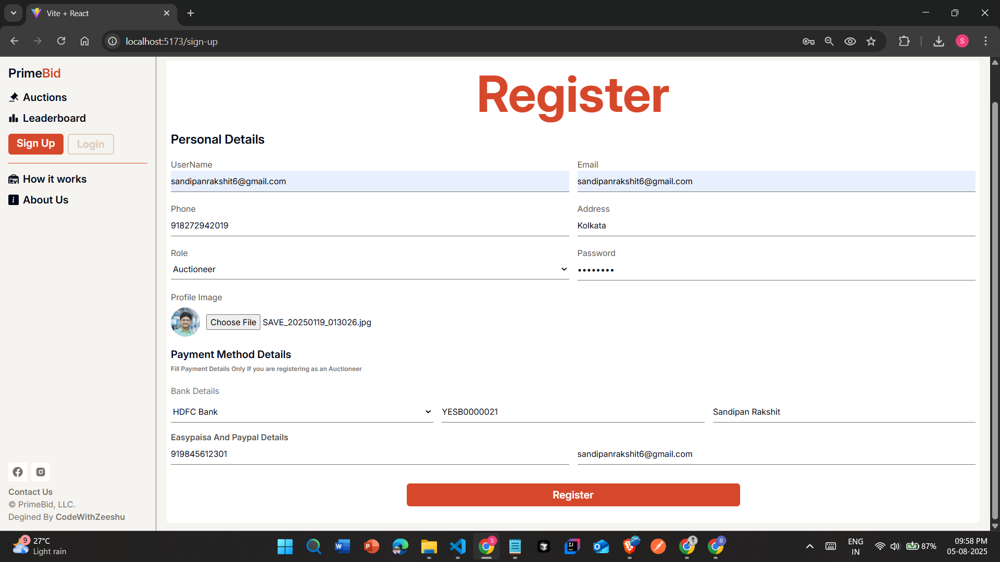
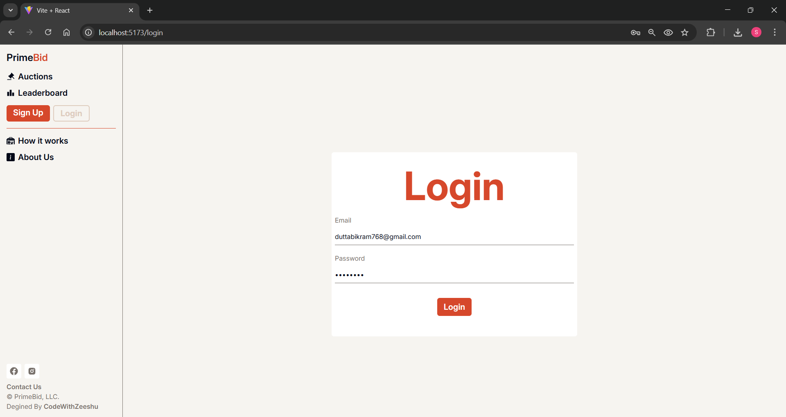
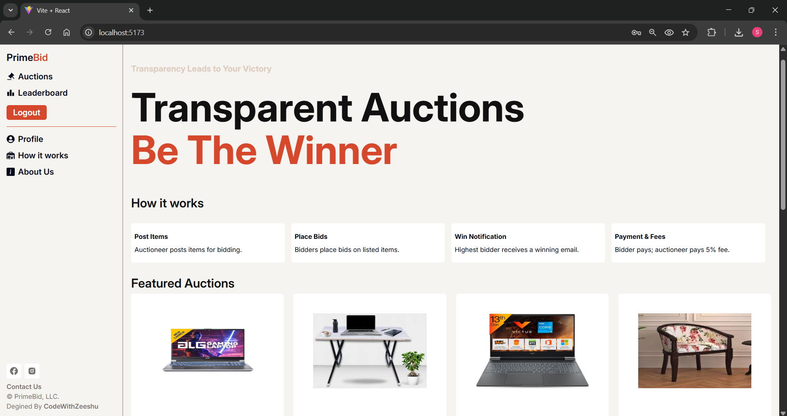
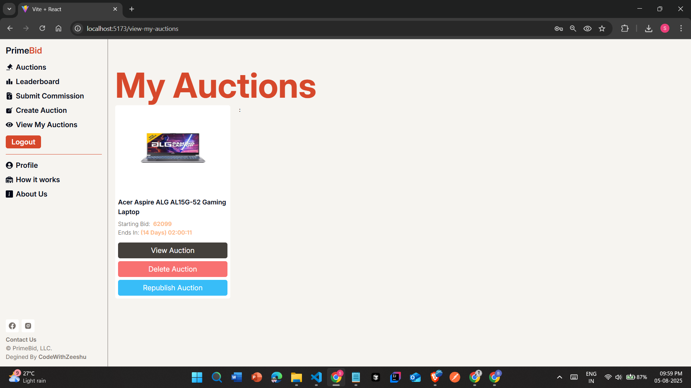
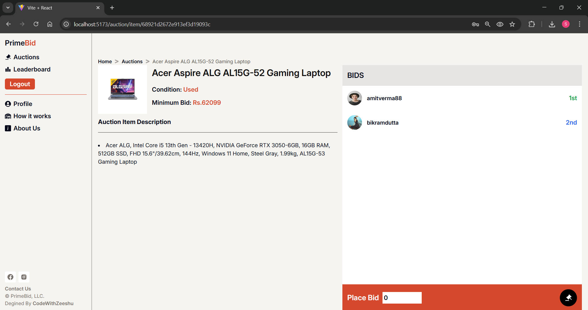
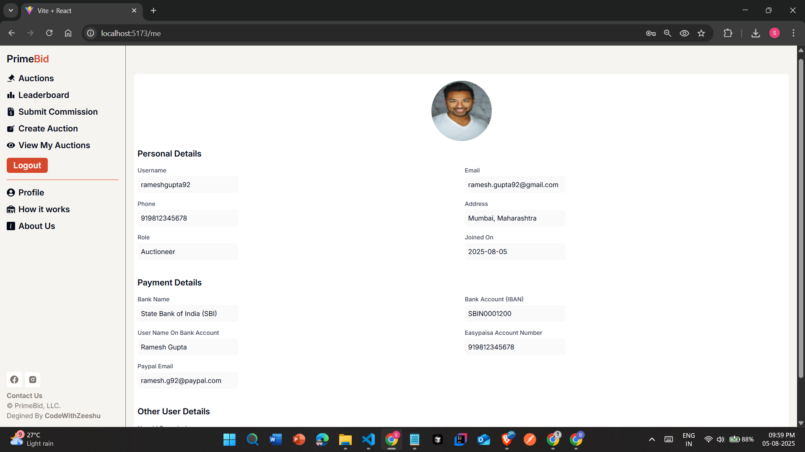

# 🏷️ BidSmart: Full-Stack Auction Website

A fully functional, responsive **auction web application** built with **React.js**, **Node.js (Express)**, and **MongoDB**. Designed for seamless bidding experiences, it allows users to post products, bid in real-time, and view live auction updates.

---

## 📌 Table of Contents

- [🧠 About the Project](#-about-the-project)
- [💡 Problem Statement](#-problem-statement)
- [✅ Features](#-features)
- [🛠️ Technologies Used](#-technologies-used)
- [🚀 Setup Instructions](#-setup-instructions)
- [📸 Screenshots](#-screenshots)
- [✨ Unique Points](#-unique-points)
- [📬 Contact](#-contact)

---

## 🧠 About the Project

**BidSphere** is a modern auction platform where:
- Sellers can post products for bidding.
- Users can bid in real-time.
- Live countdown timers show time left on each product.
- Winning bids are automatically processed after the timer ends.
- Everything is powered by real-time updates and secure backend logic.

---

## 💡 Problem Statement

Traditional auction processes lack digital flexibility and real-time interaction. This project addresses:
- Real-time auction and bidding system
- Product listing by users
- Automatic bid closing after timer ends
- Secure and scalable backend logic

---

## ✅ Features

### 🔐 User Authentication
<div align="center">
  <table>
    <tr>
      <td>
        
      </td>
      <td>
        
      </td>
    </tr>
  </table>
</div>

- Register/Login with hashed password (bcrypt)
- JWT-based session management
- Role-based routing (seller vs bidder)

### 🛒 Product Listing (Sellers)
<div align="center">
  <table>
    <tr>
      <td>
        
      </td>
      <td>
        
      </td>
    </tr>
  </table>
</div>

   - Post products with image, title, description, and starting price
   - Set auction duration using a live timer
   - Products get listed publicly in real-time

### ⏱️ Live Auction & Real-Time Bidding

<div align="center">
  <table>
    <tr>
      <td>
        
      </td>
      <td>
        
      </td>
    </tr>
  </table>
</div>

- View products available for bidding
- Place a bid higher than current bid
- Timer countdown shown on each card
- Highest bidder wins after countdown ends

### 🧾 Bid History
- View bid history for each product
- Admin/seller access to all bids
- Track bidder name, amount, and time

### 🧰 Admin Panel (Optional)
- Remove users/products
- Moderate inappropriate listings

---

## 🛠️ Technologies Used

### 🔹 Frontend:
- React.js
- Tailwind CSS / Bootstrap (based on your UI stack)
- Axios
- React Router

### 🔹 Backend:
- Node.js
- Express.js
- MongoDB with Mongoose

### 🔹 Database:
- MongoDB (no manual schema setup needed)
- Programmatically creates collections & documents

### 🔹 Authentication:
- JWT (JSON Web Tokens)
- bcrypt for password hashing

### 🔹 Real-Time:
- setInterval for countdown timers
- WebSocket / polling (optional if real-time updates enabled)

### 🔹 File & Media:
- Cloudinary (for image hosting)
- Gmail API for email notifications


---

## 🚀 Setup Instructions

## Clone the repo and navigate to the backend folder:
   ```bash
   git clone https://github.com/sandipanrakshit34/BidSmart-Full-Stack-Auction-Website
```


### 🔧 Backend Setup

1. Go to the `backend` folder and open the file `config.env` under the `config` folder.

2. Replace the content with your own credentials:

   ```env
   PORT = 5000

   CLOUDINARY_CLOUD_NAME = {Your Cloudinary UserName}
   CLOUDINARY_API_KEY = {Your Cloudinary API Key}
   CLOUDINARY_API_SECRET = {Your Cloudinary Secret Key}

   FRONTEND_URL = http://localhost:5173

   MONGO_URI = {Your MongoDB URL}

   JWT_SECRET_KEY = {Your JWT Secret Key}
   JWT_EXPIRE = {Your JWT Secret Key Expiry Date}
   COOKIE_EXPIRE = 7

   SMTP_HOST = gmail
   SMTP_PORT = 465
   SMTP_SERVICE = smtp.gmail.com
   SMTP_MAIL = {Your SMTP Mail}
   SMTP_PASSWORD = {Your SMTP Password}
   ```

   ✅ Replace the placeholders (`{}`) with your own credentials.

3. In the terminal, run the following commands:

   ```bash
   cd backend
   npm install
   npm install --save-dev ajv@^7
   npm run dev
   ```

   This should start your backend server on **port 5000** (or as specified).

---

### 💻 Frontend Setup

1. Go to the `frontend` folder.

2. Open a **new terminal** and run the following commands:

   ```bash
   cd frontend
   npm install
   npm install --save-dev ajv@^7
   npm run dev
   ```

3. Now copy and paste this URL into your browser:

   ```
   http://localhost:5173/
   ```

   Your frontend app should now be running!

---

## 📸 Screenshots

| Login Page | Product Listings | Bidding Page |
|------------|------------------|--------------|
|  |  |  |

> *(Replace image paths as per your project)*

---

## ✨ Unique Points

- Real-time auction countdown on every product
- Highest bid updates instantly
- MongoDB collections and database created automatically
- Fully responsive modern UI
- Cloudinary media storage & Gmail-based email system
- Secure JWT authentication
- Admin and bidder role separation

---

## 📬 Contact

For setup help, contributions, or inquiries:

📧 Email: sandipanrakshit6@gmail.com
